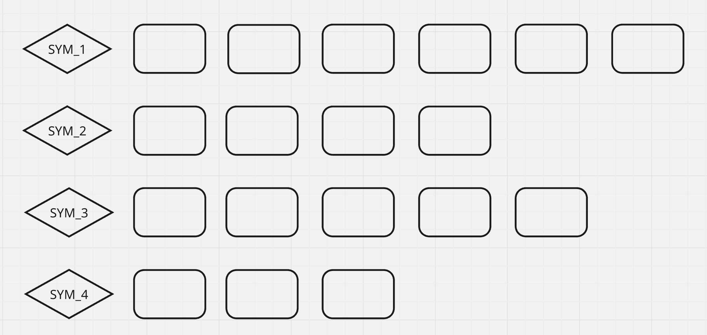
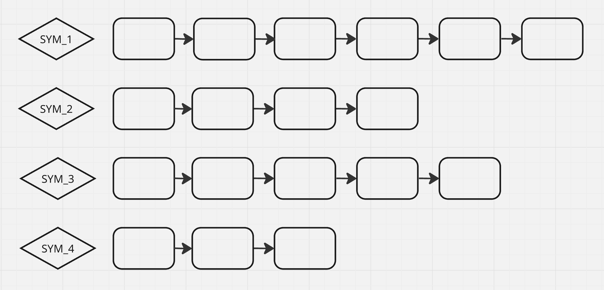
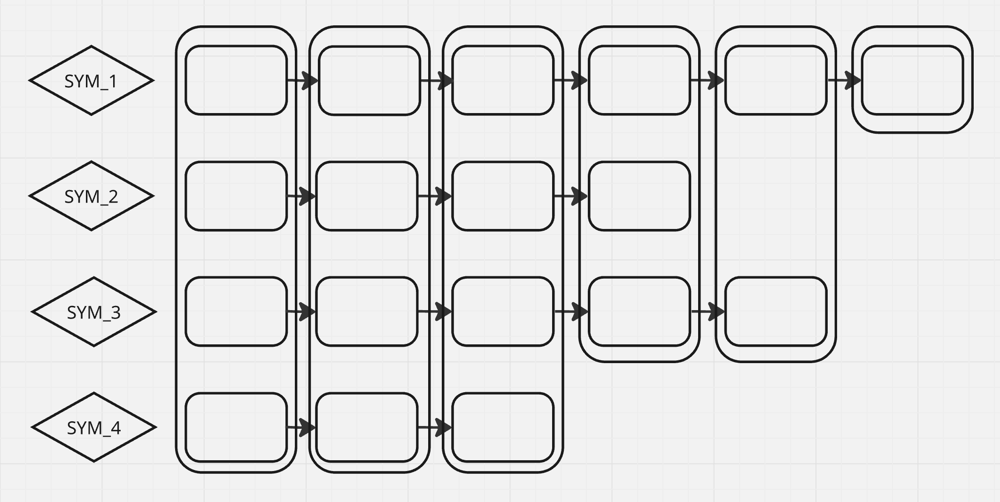
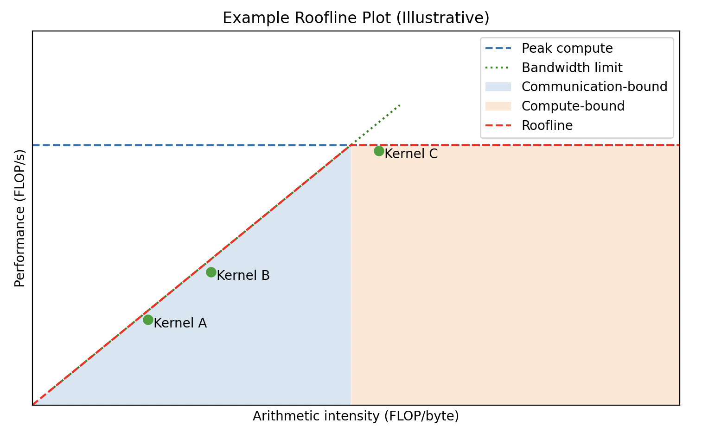
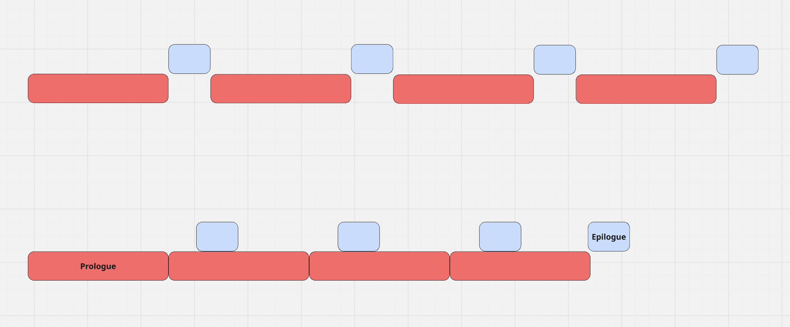

# PyTorch GPU Optimizations Walkthrough


This repository is a guided walkthrough in making a slow inference client fast. You are meant to move in order, with the goal being to build an intuition for how to identify and resolve bottlenecks by repeatedly profiling and fixing what the evidence points at. This version is focusing on changes that can be made at the CUDA Runtime API level without tinkering with model internals, and considering implementation time as a constraint as opposed to pure performance.

There is a path for people who can run the code on a device with an NVIDIA H100, and a path for people who can only read.

---

## Table of Contents
- [What You're Optimizing](#what-youre-optimizing) 
- [Repo Structure](#repo-structure)
- [How To Use](#how-to-use)
  - [Runnable Path](#runnable-path) 
  - [Read-Only Path](#read-only-path)
- [The Walkthrough](#the-walkthrough)
  - [Optimization 1](#optimization-1)
  - [Optimization 2](#optimization-2)
  - [Optimization 3](#optimization-3)
  - [Optimization 4](#optimization-4)
  - [Optimization 5](#optimization-5)
  - [Optimization 6](#optimization-6)
  - [Optimization 7](#optimization-7)
---

## What You’re Optimizing

This inference client was taken from the Jane Street x GPU MODE 9/6/2025 Hackathon.

The system processes a stream of requests. Each request:
- Has ~79 numeric features  
- Belongs to a symbol  
- Updates and reuses symbol-specific state  
- Produces a 4-component prediction  

This shape creates classic performance traps:
- Too many tiny kernel launches  
- Python overhead on hot paths  
- Bad batching  
- CPU/GPU syncs  
- Missed compilation and capture opportunities  

Which makes it perfect for learning.

---

## Repo Structure

`optimizations/` contains multiple full working variants of the same client.

Each subdirectory has:
- `inference.py` – hot path logic with all of the optimizations so-far.

`optimizations/baseline` contains the inference.py you should start with, which is faithful to what we were given to start in the actual hackathon.

Folders are ordered to enforce a learning path. Names are intentionally vague to avoid spoilers.

---

## How To Use 

### Runnable Path

In the project root, run (assuming CPython 3.10 and Linux):

`pip install -r requirements.txt`

`cd optimizations`

You are given a local evaluator adapted to this walkthrough to see latencies and error rates on a small set of batches. This is similar to what was given in the hackathon.

To run it, make sure you are in the `optimizations` directory and run:

`python local_evaluator.py <opt_folder>`

Example: `python local_evaluator.py opt_1`

You are also given a profiler for generating traces with the Python profiler. I recommend examining the code to get a sense of how you would profile your own sytems. This was not given in the hackathon, but will make this walkthrough more informative. 

To run it, make sure you are in the `optimizations` directory and run:

`python profiler.py <opt_folder>`

Example: `python profiler.py opt_1`

This will generate a trace with the folder name as a prefix

Example: `opt_1_trace.json`

You can load the trace in `chrome://tracing`, or [Perfetto UI](https://ui.perfetto.dev) (recommended for large traces)

Use the baseline trace to get a feel for how the profiler works. You should be able to point at where wall clock time is, where kernels running on the GPU stream are, how to zoom in on intervals of time, and how the stack is being represented in the CPU thread (left-to-right is wall clock time, top-to-bottom is depth of function frames in call stack). This will help you diagnose bottlenecks and make better comparisons.

Read each optimization in order, and follow along to the best of your ability (try making your own `optimizations` subdirectories).

---

### Read-Only Path

If you can’t run this repo, you should be able to load the profile traces and eval outputs from the hyperlinks. If not, download the files from the [v1 release](https://github.com/TheJDen/janestreet-gpu-mode-2025/releases/tag/v1.0).

I recommend taking an approach where you make predictions and actually write them or type them out before reading. This helps hold you accountable as you solidify your understanding, because you can compare where your output fell short or went wrong.

Here is a potential way of going through this walkthrough:
- Read each optimization in order
- First inspect the `inference.py` source and write down what you predict the Perfetto trace looks like and what the largest bottleneck or next thing to work on should be
- View the Perfetto Trace and read the hint if you need a nudge, and change your prediction if necessary
- Read the explanation and compare it your prediction
- Try implementing the change implied by the explanation in code (actually type it out in an IDE)
- Compare your solution to the code changes

---

# The Walkthrough

The first few traces are really big and may be slow to load

---

## Optimization 1

- [Baseline Source](https://github.com/TheJDen/janestreet-gpu-mode-2025/blob/main/optimizations/opt_0_baseline/inference.py)
- [Baseline Trace](https://ui.perfetto.dev/#!/?url=https://thejden.github.io/artifacts/perfetto/opt_0_baseline_trace.json)
- [Baseline Eval](https://thejden.github.io/artifacts/eval-small/opt_0_baseline_eval.txt)

<details>
<summary>Hint</summary>

For each batch of requests we are receiving, the profiler indicates we are processing them all one-by-one, meaning our wall clock time scales with the number of requests. If you zoom in on a specific request, you can see the GPU is actually completing all of its kernels quickly, and is spending most of its time idle. This means the GPU has a lot of room to do more work in parallel; do we need to process all of these requests sequentially?

Pain point to stare at:

```python
for symbol, symbol_requests in requests_by_symbol.items():
  state = self.states[symbol]
  for req in symbol_requests:
  	features = torch.tensor([req.features], device=self.device)
    with torch.inference_mode():
      pred, state = self.model(features, state)
    ...
  self.states[symbol] = state
```

</details>

<details>
<summary>Explanation</summary>

In the baseline, requests are handled mostly one-by-one. For each request:

 - A tiny CPU tensor is built and shipped over PCIe to the GPU
 - Python goes through the dispatcher to launch several small CUDA kernels (our model).
 - The next request depends on the previous request's state, so you wait for it to finish, and update the symbol's state
 - Then the next one starts

So wall-clock time grows almost linearly with the number of requests.

By grouping independent requests together into minibatches, you can process many requests in parallel, and pay overhead from:

 - Python
 - the dispatcher
 - kernel launches
 - PCIe transfers

once per minibatch instead of once per request.

Then wall-clock time grows almost linearly with the number of minibatches, not the number of requests.

So, how do we determine how to group requests?

### Using a DAG to Visualize Dependencies



This is how we are presented our `requests_by_symbol` in `NnInferenceClient.process_batch`. Each symbol has a corresponding set of requests with features we can use to generate predictions.



We can indicate which requests are prerequisite to others with arrows. Our models are stateful, so each request for each symbol needs the state generated from the previous request for that symbol, or we will lose prediction accuracy. We can indicate this dependence with an arrow, and this will build a **directed acylic graph**, or a **DAG**



As we can see, there are several independent requests across symbols which we can process in parallel. We can group the requests breadth-first across the arrows. This results in a number of minibatches equal to the longest number of requests for a single symbol, with each minibatch having a dynamic size depending on which symbols have requests at that position.

### Why It Works

The main thing we care about here is **system throughput**.

At the system level, throughput means: how many requests per second the system can complete.

That system throughput is mainly limited by three things:

 - **GPU throughput**: how many operations the GPU can do per second
 - **Bandwidth**: how much data we can move between CPU and GPU per second, and how much data we can move between GPU cores and GPU HBM per second
 - **System overhead**: the fixed work around each model call, like:
   - Python control flow
   - dispatcher logic
   - kernel launch setup
   - allocation and bookkeeping
   - transfer setup costs

So in this system:

 - System throughput is low when overhead dominates each request.

 - GPU throughput is low when kernels are tiny or starved.

Batching helps because:

 - It increases system throughput by amortizing overhead and bandwidth across many requests.
 - It feeds the GPU enough work to raise GPU throughput.

The reason batching doesn’t make individual calls very slow is that the GPU is a throughput powerhouse — and in the baseline it was being starved.
When you batch, you finally give it enough work to chew on.

### Code Changes

The change replaces per-request execution with grouped execution. This was tricky because the models are stateful. This means we can only group together requests across symbols, and that we must also keep track of batching for the model state. The model state consists of many nested lists of tensors for each tower, so we use recursion to batch.

```python
    def batch_states(self, states):
        if isinstance(states[0], torch.Tensor):
            batched = torch.cat(states, dim=0)
            return batched
        return [self.batch_states(list(s)) for s in zip(*states)]

    def unbatch_state(self, batched_state):
        if isinstance(batched_state, torch.Tensor):
            B = batched_state.size(0)
            return [batched_state[i:i+1] for i in range(B)] # remember individual states had batch dim 1
        return list(zip(*[self.unbatch_state(child) for child in batched_state]))

    def interleave_by_symbol(self, requests_by_symbol):
        n = max(len(reqs) for reqs in requests_by_symbol.values())
        for i in range(n):
            uids, symbols, features = [], [], []
            for symbol, reqs in requests_by_symbol.items():
                if i >= len(reqs):
                    continue
                req = reqs[i]
                symbols.append(symbol)
                uids.append(req.unique_id)
                features.append(req.features)
            yield uids, symbols, torch.tensor(features)

```

And modify our batch processing accordingly

```python
        for uids, symbols, batched_features in batches:
            batched_features = batched_features.to(device=self.device)
            batched_state = self.batch_states([self.states[symbol] for symbol in symbols])
            
            with torch.inference_mode():
                batched_preds, batched_state = self.model(batched_features, batched_state)

            unique_ids.extend(uids)
            preds.extend([pred.cpu().squeeze(0).numpy().astype(float).tolist() for pred in batched_preds])

            for symbol, state in zip(symbols, self.unbatch_state(batched_state)):
                self.states[symbol] = state
```

If you look at the profiler trace now, you should see:
 - Fewer model invocations per batch
 - Wider generalized matrix multiplication (GEMM) kernels that do more work each time

That’s the GPU doing what it’s good at: lots of work, all at once.

</details>

---

## Optimization 2

- [Optimization 1 Source](https://github.com/TheJDen/janestreet-gpu-mode-2025/blob/main/optimizations/opt_1/inference.py)
- [Optimization 1 Trace](https://ui.perfetto.dev/#!/?url=https://thejden.github.io/artifacts/perfetto/opt_1_trace.json)
- [Optimization 1 Eval](https://thejden.github.io/artifacts/eval-small/opt_1_eval.txt)

<details>
<summary>Hint</summary>

We've cut down model invocations for each batch, but each invocation is still pretty wide. If we zoom in on the trace, we see the GPU stream looks sort of like a barcode; our GPU is finishing its jobs quickly and spending most of its time doing nothing! To take better advantage of our compute, we want our stream to be dense with wide kernels packed together tightly, rather than sparse with lots of skinny kernels and idle time in between. If only there were a quick way to cut down on overhead and merge kernels together...

</details>

<details>
<summary>Explanation</summary>

### Concepts: torch.compile, [Dataflow Graphs](#dataflow-graph-capture-and-graph-breaks), [Arithmetic Intensity](#arithmetic-intensity-machine-balance-and-roofline-analysis), [Automated Kernel Fusion](#automated-kernel-fusion), [CUDA Graphs](#cuda-graphs)

Let's revisit the 3 things constraining our system's throughput: GPU throughput (compute), bandwidth (communication), and overhead.

The time for each of these constraints can overlap (but won't always necessarily, especially without our help). Therefore, we can **lower-bound inference time by using the maximum of compute, communication, and overhead time**. We can also **upper-bound with their sum**. When one constraint has more time dedicated to to it than the others, we say an algorithm is bound by that constraint. So an algorithm may be **compute-bound**, **communication-bound**, or **overhead-bound**. 

The system is clearly overhead-bound. Reading in the features and writing out the predictions barely register as a blip in wall-clock time in comparison to the model, and the most common thing to see when we zoom in on the model kernels is lots of idle time between them. The source of overhead is a combination of things. When we run the model in eager PyTorch, each iteration looks like this:
 - Python executes your forward function line by line.
 - Each line that touches a tensor calls into PyTorch’s dispatcher.
 - The dispatcher figures out which kernel to use.
 - It sets up arguments, checks types, shapes, devices.
 - Then it launches a kernel.
 - Then Python resumes and decides what to do next.

This loop keeps Python in the hot path, dooming us to have large idle gaps in the GPU stream. The biggest win here will be anything that helps reduce how much is going on in-between kernels.

When we are overhead-bound, the system upgrades that would give us the biggest speedup would be to buy a faster CPU, faster interconnect, or upgrade our driver. In other words, when we are not compute-bound, in the heavy-overlap case our program could be running just as fast on a less powerful GPU, and we are essentially burning money paying for H100 performance that is left on the table. This is because we are not utilizing our GPU hardware well.

### Dataflow Graph Capture and Graph Breaks

The main benefit of `torch.compile` is lifting Python overhead out of the hot path and enabling graph-level optimization. When we wrap our model call with it, TorchDynamo intercepts Python execution and traces tensor operations into a static Torch FX graph. Control flow and tensor metadata (shapes, strides, dtypes) are guarded and specialized. This FX graph is lowered into a backend internal representation (TorchInductor by default), where kernel fusion, scheduling, and memory planning occur. Inductor then generates optimized device kernels (often Triton or CUDA). For subsequent invocations with compatible inputs, the cached compiled graph is reused and the pre-generated kernels are launched directly, largely bypassing Python-level op dispatch.

In the best case, `torch.compile` will be able to capture our entire model into a full graph. However, if it encounters operations it can't compile, it will fall back to eager mode to execute the offending code, and the offending code will split the full graph into parts. This is called a **graph break**. Graph breaks mostly occur when control flow is dynamic, like data-dependent Python conditionals, functions with side effects like `print`, and exception-driven logic.

We can make `torch.compile` error out when there are graph breaks by using the `fullgraph=True` argument, and try to resolve any graph breaks we encounter. Luckily for our case, there were none.

*How will the static graph be able to handle our dynamic batch sizes?* By default it won't, and different batch sizes will trigger graph recapture. We can mitigate this by indicating to TorchDynamo that it shouldn't specialize kernels on the batch dimension with `torch._dynamo.mark_dynamic`. For our use case where we expect to run this for several hours, there will only be so many recaptures, so this won't make a huge difference besides the one-time cost of recapture, and the overhead of storing the cached graphs, which we can afford. In fact, adding this when you can afford not to have it may leave specialization on the table.


### Arithmetic Intensity, Machine Balance, and Roofline Analysis

When we made our minibatches, besides amortizing the cost of overhead, we also made progress towards making our system compute-bound because we increased the throughput of our GPU. This was visible through the wider GEMM kernels.

One way to tell if an algorithm will be compute-bound or communication-bound is to look at its **arithmetic intensity** (also sometimes called operational intensity or computational intensity).

Arithmetic intensity is the ratio of the total FLOPs an algorithm performs to the number of bytes it needs to communicate.

For specific kinds of operations on specific data types, our GPU accelerator has an intrinsic **machine balance**, or peak arithmetic intensity, that can be found by taking the ratio of its peak throughput (FLOPS/s) to its peak bandwidth (bytes/s).



This is a rough visualization of what the space of possible performances our model could have might look like. For low algorithmic intensities, we will be communication-bound, and for high algorithmic intensities, we will be compute-bound. The **minimum of each forms a roofline**. We can use the roofline to gauge room for optimization (close to the roofline means close to the limits of our hardware, far from the roofline means there is room for optimization).

Realistically, modern matmul implementations aggressively tile the computation and exploit reuse of the weight matrix from L2 cache, shared memory, and registers, so only a fraction of the nominal weight traffic is served by HBM, but we can still use HBM bandwidth to compute a lower bound for machine balance (or upper bound on performance). [H100 NVL](https://www.nvidia.com/en-us/data-center/h100/) has a throughput of 60 (TFLOPs/s) for fp32 without tensor cores and an HBM bandwidth of 3.9 (TB/s), so its peak intensity is about 15 (FLOPs/byte). With TF32 Tensor Cores, our H100 can achieve a throughput of 835 (TFLOPs/s), and a peak intensity of about 214 (FLOPS/byte). It can be much higher with smaller data types and sparsity.

To put this in perspective, 32-bit GEMM has an arithmetic intensity of about half the batch size when the hidden dimensions of our model are large. So if we want a series of on-device full-precision matrix multiplications to saturate our H100 compute and bring us to the a compute-bound regime, we will need to have a batch size of around 30 without tensor cores, and about 430 with TF32 tensor cores. Revisiting the HBM vs L2 or L1/shared memory point, the bandwidth for each is about 12 (TB/s) and 33 (TB/s), meaning being bound by L2 or L1 cache would make us reach the compute-bound regime at an arithmetic intensity ~3x–10x lower respectively, because the effective bandwidth is ~3x–10x higher. You can roughly picture that the slope of the memory roofline is steeper, and so the intersection with the compute roofline moves to the left.

For the tensor core case, that's still more than the number of symbols we received in the hackathon by a lot. Luckily, there are other ways to increase the arithmetic intensity of our kernels. One way is by reducing bytes moved; if we use bf16 instead of fp32, our bandwidth would get cut in half, but we will lose precision, which may be worth it. Another way is to increase the number of FLOPs in the algorithm. For our case, because we are doing hundreds of kernels each invocation, finding operations that can be fused together into one big kernel should help; there will be fewer kernels to launch, and each one will have a higher arithmetic intensity.

### Automated Kernel Fusion

This is a secondary benefit of using `torch.compile`. When TorchInductor gets our program IR, it identifies regions to fuse into single Triton kernels, or calls into CUDA/CPU librarires like cuBLAS or cuDNN for large ops. This eliminates intermediate memory traffic and synchronizations and packs more ops into a single kernel, essentially giving us more arithmetic intensity for free.

*Why not use `torch.compile` on the entire forward pass and state update?* Ideally we would. However, our recursive in-place update on dynamic batches blow up the FX graph and makes it hard for Inductor to prove safety and is susceptible to breaking on each recapture.

### CUDA Graphs

One thing `torch.compile` wont do for us by default is remove kernel launches. Even with the cached dataflow graph, our CPU will still make a host API call (`cudaLaunchKernel`) to the driver for each kernel, forcing us to pay some overhead for each one. Luckily, for static graphs like this there is a CUDA driver feature we can take advantage of, **CUDA Graphs**.

With a CUDA Graph, you do a capture once: the runtime/driver records the sequence of operations you enqueue on a stream (kernel launches, memcpy, memset, events, etc.) into a graph structure (yet another DAG). Then you instantiate it, which compiles/lowers that graph into an executable graph object. When you replay (`cudaGraphLaunch`), the CPU issues one launch command, and the driver enqueues a launch descriptor, the recorded batch of GPU work with dependencies already resolved, instead of re-walking and re-validating each kernel launch from scratch.

This graph is different from the `torch.compile` dataflow graph and more the responsibility of the driver. To make a clear distincition, `torch.compile` is a program compiler, and CUDA Graphs are a command submission compiler.

*Why doesn't `torch.compile` do this by default?* CUDA Graphs are extra picky and will replay the exact operations on the exact same memory addresses, meaning the inputs and outputs must be loaded into the same buffers. `torch.compile` will do the work of orchestrating this for you when you use the `mode="reduce-overhead"` argument, at the expense of an extra memory copy for the inputs and outputs (which are small in our case).

The bigger problem is that since a CUDA Graph uses the same buffers, the inputs and outputs need to keep their exact shapes, meaning any time we call the model with differently shaped data, we have to recapture a new CUDA Graph. There is no `torch._dynamo.mark_dynamic` equivalent here, because the main way we are eliminating this overhead is by making the assumption that we are launching the same programs on the same shapes. The only reason this is viable for our current setup is that we expect to call the model repeatedly for hours, and to only encounter a few batch sizes we can recapture and cache.

### Code Change

A big win of `torch.compile` is its simplicity. The `fullgraph=True` argument tells `torch.compile` to raise an error if Dynamo has to create any breaks while it records from finding unsupported operations, rather than ignoring them. This can be used to ensure that the model is fully compilable without having to unknowingly give the reigns back to Python, and makes the model more compatible for fusion.

```python
self.model = torch.compile(
            self.model,
            fullgraph=True,
        )
```

### Code Change

The `mode="reduce-overhead"` argument tells `torch.compile` to try reducing kernel launches using CUDA Graphs.

```python
self.model = torch.compile(
            self.model,
            fullgraph=True,
            mode="reduce-overhead"
        )
```

When we get the state back from the model and try to save it directly, we run the risk of it getting clobbered during the next invocation because the state is being shared somewhere under-the-hood. Python warns us about this with an error saying something like

`RuntimeError: Error: accessing tensor output of CUDAGraphs that has been overwritten by a subsequent run.`

The solution is to copy our outputs and state because we need to persist them.

```python
	def unbatch_state(self, batched_state):
        if isinstance(batched_state, torch.Tensor):
            B = batched_state.size(0)
        	return [batched_state[i:i+1].clone() for i in range(B)] # remember individual states had batch dim 1, clone to persist CUDA graph result
```
</details>

## Optimization 3

- [Optimization 2 Source](https://github.com/TheJDen/janestreet-gpu-mode-2025/blob/main/optimizations/opt_2/inference.py)
- [Optimization 2 Trace](https://ui.perfetto.dev/#!/?url=https://thejden.github.io/artifacts/perfetto/opt_2_trace.json)
- [Optimization 2 Eval](https://thejden.github.io/artifacts/eval-small/opt_2_eval.txt)

<details>
<summary>Hint</summary>

Can we get rid of some of those annoying CUDA Graph recaptures?

</details>

<details>
<summary>Explanation</summary>

### 

`torch.compile` and CUDA Graphs are working great in most places and give us very dense invocations with almost no overhead. However, CUDA Graphs demand stable shapes, and our batching logic is still dynamic. Every time we construct a batch with a different number of requests, we will take a hit for recapturing the CUDA Graph if its shape hasn't been seen. This is also why our state update is looking long—most of the logic is in Python, meaning there is a lot of overhead between operations.

Instead, we can have a row for each symbol in our batch, and only update the relevant rows with the model output. The other rows will be doing useless computation, but remember, compute is in abundance.

By redesigning batching to use a static batch layout, we stop triggering graph recapture. We also enable usage of specialized functions to copy our state for multiple symbols in one step, and eliminate the need to allocate new lists and buffers each update, reducing a lot of overhead from Python.

### Code Changes

Now when we initialize state, we initialize only one state with a row for each symbol

```python
		self.B = self.num_symbols 
        self.symbols_state = self.model.init_state(self.B, self.device)
        self.symbol_to_index = {f"SYM_{i:03d}": i for i in range(self.num_symbols)}
```

When we construct our minibatches, we make sure to pad accordingly, and yield a mask indicating which rows to keep

```python
	def interleave_by_symbol(self, requests_by_symbol):
        n = max(len(reqs) for reqs in requests_by_symbol.values())
        for i in range(n):
            symbols_features = torch.empty((self.B, self.config.num_features))
            symbols_mask = torch.zeros((self.B,), dtype=torch.bool)
            uids_by_row = [None] * self.B
            for symbol, reqs in requests_by_symbol.items():
                if i >= len(reqs):
                    continue
                req = reqs[i]
                symbol_index = self.symbol_to_index[symbol]
                uids_by_row[symbol_index] = req.unique_id
                symbols_mask[symbol_index] = True
                symbols_features[symbol_index].copy_(torch.tensor(req.features))
            uids = [uid for uid in uids_by_row if uid is not None]
            yield uids, symbols_features, symbols_mask
```
 
Now our update can copy all of the symbols at once on-device. We can also reuse the state buffers, skipping allocations each update.
 
```python
    def update_state(self, new_state, mask, old_state=None):
        old_state = old_state if old_state is not None else self.symbols_state
        if isinstance(new_state, torch.Tensor):
            update = mask.view(self.B, *([1] * (new_state.ndim - 1)))
            torch.where(update, new_state, old_state, out=old_state)
            return
        for new_s, old_s in zip(new_state, old_state):
            self.update_state(new_s, mask, old_s)
```
 
Lastly, we update our state logic in the main loop
 
```python
 		for uids, symbols_features, symbols_mask in minibatches:
            symbols_features = symbols_features.to(device=self.device)
            symbols_mask = symbols_mask.to(device=self.device)
            
            with torch.inference_mode():
                symbols_pred, symbols_state = self.model(symbols_features, self.symbols_state)
            self.update_state(symbols_state, symbols_mask)

            unique_ids.extend(uids)
            preds.extend(symbols_pred[symbols_mask].cpu().numpy().astype(float).tolist())
```

Notice how we removed our dynamo dynamic indications; we can also use the `dynamic=False` argument in `torch.compile` to encourage shape specialization.

```python
        self.model = torch.compile(
            self.model,
            fullgraph=True,
            mode="reduce-overhead",
            dynamic=False
        )
```

We should see no more recaptures now that the shapes are static from `torch.compile` nor CUDA Graphs. This step was mostly to reduce the variance of our prediction times, and helps to enable new optimizations and reduce their implementation complexity.

</details>

---

## Optimization 4

- [Optimization 3 Source](https://github.com/TheJDen/janestreet-gpu-mode-2025/blob/main/optimizations/opt_3/inference.py)
- [Optimization 3 Trace](https://ui.perfetto.dev/#!/?url=https://thejden.github.io/artifacts/perfetto/opt_3_trace.json)
- [Optimization 3 Eval](https://thejden.github.io/artifacts/eval-small/opt_3_eval.txt)

<details>
<summary>Hint</summary>

We are communication-bound now from device-to-device copies, and there are still quite a few kernel launches in our state update.

</details>
<details>
<summary>Explanation</summary>

Now that our state update has static shapes, it is a prime candidate for reducing overhead with CUDA Graphs; we are already reusing the tensors anyway. A more subtle point is that we are creating new input, prediction, and state tensors for each forward pass, and `torch.compile` is copying to and from them into persistent buffers it allocated to facilitate our use of CUDA Graphs. We can allocate these buffers ourselves and capture the graph ourselves, and eliminate both the kernel launch overhead from the state update and the now unnecessary I/O copies. Notice that this would have been much harder to implement with the dynamic batch size, and so `torch.compile` was still the right tool to reach for first.

### Code Changes

First, we allocate persitent on-device buffers for our input and output in `NnInferenceClient.__init__`, and create a `torch.cuda.CUDAGraph()` instance. We won't need `mode="reduce-overhead"` anymore either now that we are recording the CUDA Graph ourselves.

```python
        self.model = torch.compile(
            self.model,
            fullgraph=True,
            dynamic=False
        )

        # input/output buffers
        self.symbols_mask_buffer = torch.empty((self.B,), device=self.device, dtype=torch.bool)
        self.symbols_features_buffer = torch.empty((self.B, self.config.num_features), device=self.device)
        self.symbols_pred_buffer = torch.empty((self.B, 4), device=self.device)

        self.graph = 
        self._capture_done = False
```

Then, we create a `NnInferenceClient.predict` method to be captured. Notice how it doesn't take in any arguments or return any outputs, since the inputs and outputs are preallocated, and their addresses are known before capture.

```python
    @torch.inference_mode()
    def predict(self):
        symbols_pred, symbols_state = self.model(self.symbols_features_buffer, self.symbols_state)
        self.symbols_pred_buffer.copy_(symbols_pred) # pred is small so this is cheap
        self.update_state(symbols_state, self.symbols_mask_buffer)
```

Next, we define a `NnInferenceClient.capture` method. In the warmup, the kernel cache gets populated, memory gets allocated, and cuBLAS and cuDNN may do some autotuning. We don't want any of that happening in the hot loop, so we warmup once to get it out of the way. The synchronization call makes sure the only kernels that get recorded by our graph are those consisting of our forward pass and state update, and nothing that may still be running from a warmup pass.

```python
    def capture(self):
        # Warmup (populate allocator / pick kernels)
        for _ in range(3):
            self.predict() 

        torch.cuda.synchronize()

        # Capture
        with torch.cuda.graph(self.graph):
            self.predict()

        self._capture_done = True
```

Now when we process our first minibatch we capture, and otherwise we replay our graph. Each iteration, we update the preallocated input buffers in-place via `.copy_()`, so that the graph sees the new data in the same tensor storage.

```python
        if not self._capture_done:
            self.capture()

        minibatches = self.interleave_by_symbol(requests_by_symbol)

        for uids, symbols_features, symbols_mask in minibatches:
            self.symbols_features_buffer.copy_(symbols_features)
            self.symbols_mask_buffer.copy_(symbols_mask)
            
            self.graph.replay()

            unique_ids.extend(uids)
            preds.extend(self.symbols_pred_buffer[symbols_mask].cpu().numpy().astype(float).tolist())
```


</details>

## Optimization 5

- [Optimization 4 Source](https://github.com/TheJDen/janestreet-gpu-mode-2025/blob/main/optimizations/opt_4/inference.py)
- [Optimization 4 Trace](https://ui.perfetto.dev/#!/?url=https://thejden.github.io/artifacts/perfetto/opt_4_trace.json)
- [Optimization 4 Eval](https://thejden.github.io/artifacts/eval-small/opt_4_eval.txt)

<details>
<summary>Hint</summary>

We are still communication-bound because our forward pass and state update do multiple copies of the state tensor. If only we could easily fuse some of those kernels now that our entire forward pass and update have static shapes, preallocated inputs and outputs, and only need to get compiled once.

</details>
<details>
<summary>Explanation</summary>

Previously, dynamic shapes and mutation patterns made it difficult for TorchDynamo to trace a single, safe FX graph and for Inductor to reason about aliasing across iterations. With stable shapes and a fixed execution path, neither `torch.compile` nor the CUDA Graph runtime need to regenerate artifacts, which prevents recapture failures and avoids accumulating multiple compiled graph instances in memory.

### Code Changes

We just get rid of the `torch.compile` around the model in `NnInferenceClient.__init__` and add it to `NnInferenceClient.predict` instead.

```python
    @torch.inference_mode()
    @torch.compile(fullgraph=True, dynamic=False)
    def predict(self):
        symbols_pred, symbols_state = self.model(self.symbols_features_buffer, self.symbols_state)
        self.symbols_pred_buffer.copy_(symbols_pred) # pred is small so this is cheap
        self.update_state(symbols_state, self.symbols_mask_buffer)
```

Note: `torch.compile` turns the device-to-device copies from `torch.where` into predicated multiply-add selects. Pretty cool optimization that would have took me a while to think of.

</details>

## Optimization 6

- [Optimization 5 Source](https://github.com/TheJDen/janestreet-gpu-mode-2025/blob/main/optimizations/opt_5/inference.py)
- [Optimization 5 Trace](https://ui.perfetto.dev/#!/?url=https://thejden.github.io/artifacts/perfetto/opt_5_trace.json)
- [Optimization 5 Eval](https://thejden.github.io/artifacts/eval-small/opt_5_eval.txt)

<details>
<summary>Hint</summary>

It is hard to say without inspecting the kernels more rigorously with Nsight Compute or viewing their source, but our aggressive compilation and batching has at least pushed us away from being dominated by device-to-device copies, if not fully into a compute-bound regime! I will give you a tip we didn't get during the hackathon, which is that we can tolerate about 1e-3 absolute error before our score starts going down.

</details>
<details>
<summary>Explanation</summary>

Recall from [Arithmetic Intensity](#arithmetic-intensity-machine-balance-and-roofline-analysis) that we have a couple of levers we can pull now that we have wide dense kernels and are compute-bound or partially memory bound.

## Tensor Cores
Tensor Cores are dedicated hardware units for accelerating matrix multiplication. They can dramatically raise the compute roof for supported GEMMs up to 10x-20x in comparison to the default CUDA Cores. We can encourage PyTorch to lower into kernels that dispatch Tensor Core instructions by setting the appropriate CUDA and cuDNN flags, and using Tensor Core-friendly dtypes like bf16/fp16/tf32/fp8.

## bfloat16
bfloat16 (bf16) is a 16-bit floating type that keeps the same exponent range as fp32, but uses fewer mantissa bits. It’s much less likely to overflow than fp16, but it’s still lower precision than fp32. bf16 is attractive for inference on H100 because
 - bf16 GEMMs are designed to hit Tensor Cores efficiently.
 - bf16 lowers bandwidth pressure by halving the bytes moved versus fp32, which helps if we are even partly memory-bound.
 - bf16 is usually numerically stable because the exponent range matches fp32

To improve our runtime, our main levers without writing kernels will be making more effective use of Hopper Tensor Cores, and running our model in bf16 to reduce bandwidth and increase arithmetic intensity (nudging compute-bound kernels to that higher compute-roofline).

### Code Changes

At the top of the file, we set torch tf32 flags to encourage Tensor Core lowering. We also set the default dtype to bf16 so that the state and input tensors get initialized in bf16.

```python
torch.set_default_dtype(torch.bfloat16)
torch.backends.cuda.matmul.allow_tf32 = True
torch.backends.cudnn.allow_tf32 = True
torch.set_float32_matmul_precision('medium')
```

Then we also cast our model weights to bf16 in `NnInferenceClient.__init__`.

```python
        self.model.load_state_dict(weights)
        self.model.to(dtype=torch.bfloat16)
```

And make sure to cast our preds back to float
```python
        preds.extend(self.symbols_pred_buffer[symbols_mask].float().cpu().numpy().tolist())
```

</details>


## Optimization 7

- [Optimization 6 Source](https://github.com/TheJDen/janestreet-gpu-mode-2025/blob/main/optimizations/opt_6/inference.py)
- [Optimization 6 Trace](https://ui.perfetto.dev/#!/?url=https://thejden.github.io/artifacts/perfetto/opt_6_trace.json)
- [Optimization 6 Eval](https://thejden.github.io/artifacts/eval-small/opt_6_eval.txt)

<details>
<summary>Hint</summary>

Why is the GPU idling in between minibatches?

</details>

<details>
<summary>Explanation</summary>

### Concepts: [Implicit Synchronization](#implicit-synchronization), [CUDA Events](#cuda-events), [Pipelining](#pipelining), [DMA Engines](#dma-engines), [Paged Memory and Pinned Memory](#paged-memory-and-pinned-memory)

### Implicit Synchronization

Now that we have CUDA Graphs wrapping our logic for each minibatch, the last remaining sources of overhead are the gaps between minibatches.

Since our model is actually running on our H100, when we call `.to` or `self.graph.replay()` in PyTorch, the main thread is simply enqueueing work to be done by the GPU asynchronously. We have all of the data for our minibatches from the start of `NnInferenceClient.process_batch`, so we should be able to enqueue all of the feature copies, model invocations, and prediction copies straight away and simply wait for the GPU to finish. Even though all of the operations are serialized in the same GPU stream, the copies we do to and from the device are tiny. Those large gaps have to be from the CPU side getting forced to wait because we accidentally created a dependency between:

 - **H2D (host → device)** copies: CPU RAM → GPU HBM

 - **D2H (device → host)** copies: GPU HBM → CPU RAM

 - or the compute stream that runs the graph

The tricky part is that a lot of these waits are implicit. We didn’t call torch.cuda.synchronize(), but we still ended up synchronized.

A **sync** is when the CPU thread stalls because it needs a result (or needs a buffer to be safe) before it can queue the next useful GPU work.

That stall can be caused by:

 - blocking copies (H2D or D2H that don’t return until done)
 - accessing GPU data from CPU (e.g., `.cpu()`, `.numpy()`, `.item()`, printing a CUDA tensor)
 - reusing buffers while a previous async copy is still in flight.
 - implicit stream dependencies (copy is enqueued on a stream that’s also doing compute)

In our case, the syncs are occuring at these lines

```python
            self.symbols_features_buffer.copy_(symbols_features)
            self.symbols_mask_buffer.copy_(symbols_mask)
            ...
            preds.extend(self.symbols_pred_buffer[symbols_mask].cpu().numpy().astype(float).tolist())
```

There is a `non_blocking=True` argument that `.to()` and `.copy_()` accept which allows PyTorch to enqueue the copies and move on before completion without doing a stream sync. It is not enabled by default because it can lead to spooky behavior if you introduce race conditions.

```python
x = torch.tensor(...)
y = torch.tensor(...)
...
y.copy_(x, non_blocking=True)
del x   # oops
```

Logic like this can lead to `y` having malformed data. In our case, we have streamlined our operations and are in the clear. Because we are enqueueing the copies on the same stream as the compute, we don't have to synchronize manually; the forward pass will only be able to start after the copy that was enqueued on the same stream finished anyway.

*What about the predictions?*

This one is more subtle. The biggest offenders appear to be the `.cpu()` and `.tolist()`, because they force the main thread to stall and materialize the outputs before creating the next minibatch and enqueueing the next iteration. We don't need to materialize the preds in the main loop, and so we might think to hoist them out of the main loop.

```python
    masks = []
    for uids, symbols_features, symbols_mask in minibatches:
            self.symbols_features_buffer.copy_(symbols_features, non_blocking=True)
            self.symbols_mask_buffer.copy_(symbols_mask, non_blocking=True)
            
            self.graph.replay()

            unique_ids.extend(uids)
            masks.append(symbols_mask)
            pred = torch.empty(self.symbols_pred_buffer.shape)
            pred.copy_(self.symbols_pred_buffer, non_blocking=True)
            preds.append(pred)
    torch.cuda.synchronize() # wait for the last copy to finish
    preds = torch.cat(preds)[[torch.cat(masks)].float().numpy().tolist()]
```

However, this pushes all of the latency to the end of the loop. Now, instead of there being gaps between each minibatch, there is just a large idle period after all of the minibatches. Since the predictions are processed on CPU, ideally we want to hide this latency by overlapping it with the CUDA Graph replay on GPU.

## CUDA Events

We want the CPU to start processing predictions as soon as a minibatch is ready, without stalling the whole loop.

The problem is that “GPU work is async” is both a blessing and a curse: The CPU can enqueue a ton of work quickly, but it also has no idea when a specific minibatch finishes unless we force a sync. This is where CUDA Events come in.

**A CUDA Event is basically a timestamped marker you can drop into a CUDA stream**

When the stream reaches the event, the GPU “records” it. On the CPU, you can later ask: “has this event happened yet?” Or you can block only when needed by waiting on that event. This lets you avoid the nuclear option `torch.cuda.synchronize()`, which waits for *everything*.

## Pipelining

To achieve the overlap we want, we have to build a pipeline. **Pipelining is a loop optimization method that works by breaking the body into stages that can be done *at the same time***. In our case, we can define 2 stages for each batch: one stage copies the inputs to the GPU, replays the CUDA Graph, copies the predictions to the host device, and records a CUDA Event; the other stage blocks on the CUDA Event and materializes the predictions in our output list. The CPU thread and GPU stream enable the stages to run in parallel, but only if we overlap the first stage of a given batch with the second stage of its previous batch. This means there will be one iteration where we fill the pipeline, **the prologue**, and one iteration where we drain the pipeline, **the epilogue**. (If there were k stages, the prologue and epilogue would have length k - 1). The remaining batches will occupy a steady-state where their stages are computed in parallel.



## DMA Engines

To write memory to and from the host quickly, the GPU uses a DMA Engine. **A DMA (Direct Memory Access) Engine** is a hardware component that transfers data between system memory and GPU HBM without the CPU having to intervene. DMA Engines allow a GPU to perform H2D or D2H copies in a parallel stream; if our copies to and from the device weren't so tiny compared to our model invocation, we would do this. But they are, so we won't. The DMA Engine is what enables the asynchronous copy I mentioned earlier. The CPU can enqueue the operation and move on because the GPU has dedicated hardware that lets it move bytes to and from host memory directly.

## Paged Memory and Pinned Memory

Virtual memory complicates this. When you allocate a tensor in PyTorch, by default it is allocated in paged memory. **Paged memory can be paged out to disk, remapped, or relocated by the OS at any time**. If the OS does any of these mid-transfer, the GPU moves bytes from a stale address. To prevent this, the driver only programs the DMA Engine to operate on pinned memory. **Pinned memory, or page-locked memory, is memory in which the OS has guaranteed the physical pages wont move**. Pinned memory is expensive to allocate and store, hence why it is not the default. If we schedule a D2H or H2D copy on a tensor allocated with pageable memory, to gurantee the data doesn't become stale, the OS has to allocate a pinned tensor before it can proceed—even if the copy was marked `non_blocking=True`. This allocation acts as a synchronization; so in other words, if we want a truly asynchronous copy, we need to preallocate a pinned buffer to copy into. This pinned allocation can be achieved in parallel by doing it in another thread besides the main thread. Again, if our copies weren't so tiny compared to our model invocation, we would do this. But they are, so we won't. The only copy which really needs this is the prediction copy, because its data only becomes available once the forward pass has completed; if we wait for it, we kill our pipeline. The other copies will also block, but their data is readily-available, and the `non_blocking=True` serves more to prevent a stream sync.

In short, to achieve true async DMA transfer, the participating system memory needs to be pinned.


## Code Changes
To build our pipeline, we allocate a pinned tensor to enable async DMA transfer of the predictions once they have been generated. We assign prev variables to fill our pipeline, use them in the steady state, and then finally drain the pipeline by flushing the last remaining prev variables.

```python
        prev_mask = None
        prev_batch_preds = torch.empty((self.B, 4), pin_memory=True)
        prev_ready = torch.cuda.Event(enable_timing=False)
        for uids, symbols_features, symbols_mask in minibatches:
                
            self.symbols_features_buffer.copy_(symbols_features, non_blocking=True)
            self.symbols_mask_buffer.copy_(symbols_mask, non_blocking=True)

            self.graph.replay()
            
            unique_ids.extend(uids)
            if prev_mask is not None:
                prev_ready.synchronize()
                preds.extend(prev_batch_preds[prev_mask].float().numpy().tolist())
            prev_mask = symbols_mask.clone()
            prev_batch_preds.copy_(self.symbols_pred_buffer, non_blocking=True)
            prev_ready.record()      
        if prev_mask is not None:
            prev_ready.synchronize()
            preds.extend(prev_batch_preds[prev_mask].float().numpy().tolist())
```

</details>

---

## End

- [Final Optimization Source](https://github.com/TheJDen/janestreet-gpu-mode-2025/blob/main/optimizations/opt_7/inference.py)
- [Final Optimization Trace](https://ui.perfetto.dev/#!/?url=https://thejden.github.io/artifacts/perfetto/opt_7_trace.json)
- [Final Optimization Eval](https://thejden.github.io/artifacts/eval-small/opt_7_eval.txt)

If you can look at a PyTorch pipeline and confidently say:
“I know what to try next — and why”  
then this walkthrough did its job. I hope this was helpful and may expand in a future release.
